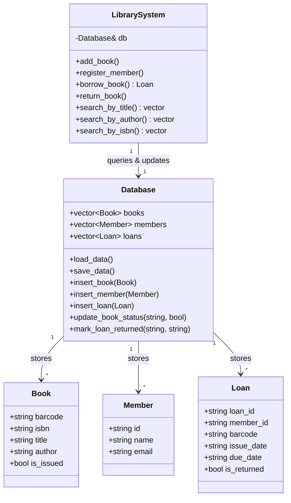

# Library Management System (C++ Implementation)

A clean, modular, and SOLID-compliant C++ implementation of a **Library Management System** featuring a flat-file relational CSV database engine.

---

## 1. Project Overview & Problem Statement
The objective is to implement a robust, lightweight Library Management System using C++ standard libraries:
- Register and manage members in the system.
- Manage books and physical copies in the library catalog.
- Support book checkout (issue) and return transactions.
- Enforce business logic constraints (e.g. max borrow limits of 5 books per member, preventing checkout of already issued copies).
- Persist state reliably across sessions using a flat-file relational CSV storage layer.

---

## 2. High-Level Architecture Design

This system separates responsibilities into three logical layers:



### Relational Database Simulation (SQL over CSV)
Rather than introducing heavy SQL database engines, this system mimics relational structures using standard CSV files:
*   `books.csv` (Book Table: barcode (PK), isbn, title, author, is_issued)
*   `members.csv` (Member Table: id (PK), name, email)
*   `loans.csv` (Loan Table: loan_id (PK), member_id (FK), barcode (FK), issue_date, due_date, is_returned)

The `Database` class simulates query interfaces (Inserts, Updates, Selects) and atomic updates to flat files, ensuring reliability and durability.

---

## 3. Project Structure
```text
library_management_system/
├── Models.h           # Core domain entity structs (Book, Member, Loan)
├── Database.h         # Database storage manager declaration
├── Database.cpp       # Database file loading/saving and transaction updates
├── LibrarySystem.h    # Business rules, validation, and search service declaration
├── LibrarySystem.cpp  # Library validation constraints and search implementation
├── main.cpp           # Main interactive console simulator
├── tests.cpp          # Automated unit testing suite
├── books.csv          # Sample populated Book table
├── members.csv        # Sample populated Member table
├── loans.csv          # Loan transactions table
└── README.md          # Project design documentation (this file)
```

---

## 4. Compile & Run Instructions

### Prerequisites
- GCC / G++ compiler supporting C++11 (like MinGW on Windows or standard g++ on Linux).

### Running the Simulator
Compile all source files and execute the compiled binary to open the interactive menu:
```bash
# Compile
g++ -std=c++11 Database.cpp LibrarySystem.cpp main.cpp -o library_simulator.exe

# Run
.\library_simulator.exe
```

### Running the Unit Tests
Compile and run the test suite to verify core business logic constraints (checkout limits, book availability, search functions, etc.):
```bash
# Compile
g++ -std=c++11 Database.cpp LibrarySystem.cpp tests.cpp -o test_runner.exe

# Run
.\test_runner.exe
```
