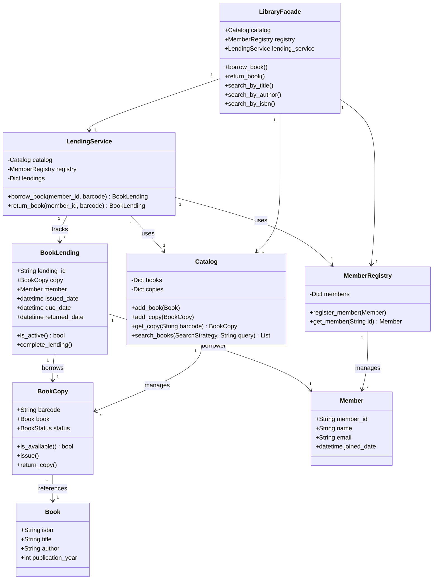

# Library Management System (Low-Level Design)

An elegant, object-oriented, and SOLID-compliant Python implementation of a **Library Management System** for modeling real-world library operations.

---

## 1. Project Overview & Problem Statement
The objective is to design and implement a robust, extensible Library Management System that models library domains:
- Adding and managing books and physical book copies in the catalog.
- Registering and managing library members.
- Tracking availability of copies (Available, Issued, Lost) and preventing issuing unavailable copies.
- Permitting members to borrow and return books while enforcing policy constraints (e.g., maximum borrowing limits).

---

## 2. High-Level Explanation of the Design

This system leverages core **Object-Oriented Programming (OOP)** and **SOLID** principles to ensure readability, testability, and extensibility.



### Application of SOLID Principles

*   **Single Responsibility Principle (SRP):**
    *   `Book`, `BookCopy`, and `Member` act strictly as domain data entities.
    *   `Catalog` and `MemberRegistry` are dedicated repositories managing data storage & search.
    *   `LendingService` isolates all business workflow rules (like validation, limits, and transactions).
*   **Open/Closed Principle (OCP):**
    *   The search system uses the **Strategy Pattern** via the abstract class `SearchStrategy` (`search.py`). We can introduce new search algorithms (e.g., search by category, language) by adding classes without modifying the `Catalog` or existing search classes.
*   **Liskov Substitution Principle (LSP):**
    *   All concrete implementations of `SearchStrategy` (`SearchByTitle`, `SearchByAuthor`, `SearchByIsbn`) can be substituted transparently in `Catalog.search_books(...)` without changing its execution logic.
*   **Interface Segregation Principle (ISP):**
    *   The catalog client only interacts with the methods they need. The search interface is minimal and contains only a single `search()` method.
*   **Dependency Inversion Principle (DIP):**
    *   High-level workflows in the `Catalog` search delegate directly to the `SearchStrategy` abstraction rather than concrete search helper implementations.

### Design Patterns Used
1.  **Strategy Pattern**: Used to encapsulate book search strategies (Title, Author, ISBN) dynamically at runtime.
2.  **Facade Pattern**: The `LibraryFacade` class acts as a single unified interface to the system, concealing the complexity of catalog management, member registries, and lending workflows.

---

## 3. Key Classes & Responsibilities

| Class | File | Responsibility |
|---|---|---|
| `Book` | `models.py` | Encapsulates metadata (Title, Author, ISBN, Year) of a book. |
| `BookCopy` | `models.py` | Represents a physical copy with a barcode and tracks its status (`AVAILABLE`, `ISSUED`, `LOST`). |
| `Member` | `models.py` | Represents a registered reader with an ID, name, and contact details. |
| `BookLending` | `models.py` | Stores the transaction details of a borrow transaction (Dates, Member, Copy). |
| `Catalog` | `services.py` | Manages active books/copies collection and supports strategy-based searching. |
| `MemberRegistry` | `services.py` | Manages membership registration database. |
| `LendingService` | `services.py` | Orchestrates checkouts & check-ins, validation rules, and active loan constraints. |
| `LibraryFacade` | `main.py` | Unified entry point for clients interacting with the library. |
| `SearchStrategy` | `search.py` | Abstract class defining the search contract for books. |

---

## 4. Project Structure
```text
library_management_system/
├── models.py         # Entities (Book, BookCopy, Member, BookLending, BookStatus)
├── services.py       # Repositories & core business logic (Catalog, MemberRegistry, LendingService)
├── search.py         # Strategy Pattern implementations for book search
├── exceptions.py     # Custom exceptions handling business domain constraints
├── test_library.py   # Unit testing suite for all modules and scenarios
├── main.py           # Facade wrapper and a fully interactive LLD CLI demo
└── README.md         # Design documentation (this file)
```

---

## 5. Setup & Running the Project

### Prerequisites
- Python 3.8+ (tested on Python 3.11.x)

### Running the Demonstration CLI
Execute the demo script to verify all functional requirements and test scenarios (including book registration, member registration, search strategies, limits, and borrow/return workflows):
```bash
python main.py
```

### Running Unit Tests
To run the automated test suite verifying edge cases, exceptions, and core functionality:
```bash
python -m unittest test_library.py
```
