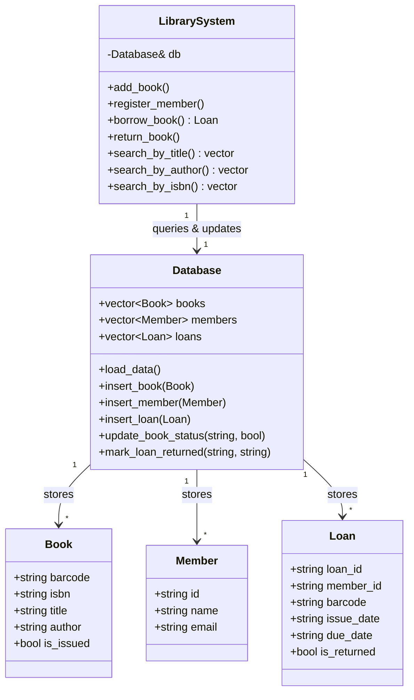

# Library Management System (C++ & SQLite SQL Implementation)

A clean, modular, and SOLID-compliant C++ implementation of a **Library Management System** featuring an embedded SQL database engine.

---

## 1. Project Overview & Problem Statement
The objective is to implement a robust, lightweight Library Management System using C++ standard libraries:
- Register and manage members in the system.
- Manage books and physical copies in the library catalog.
- Support book checkout (issue) and return transactions.
- Enforce business logic constraints (e.g. max borrow limits of 5 books per member, preventing checkout of already issued copies).
- Persist state reliably using a local SQL database without requiring server-based authentication credentials.

---

## 2. High-Level Architecture Design

This system separates responsibilities into three logical layers:



### Relational SQL Database (SQLite3)
To implement actual SQL relational mechanics without requiring database credentials, host setup, or external port configurations, the system embeds **SQLite3**:
*   Stores data locally in `library.db`.
*   Connects using SQLite3 C API handlers.
*   Enforces relational tables using standard SQL statements:
    *   `books` table: `barcode` (PK), `isbn`, `title`, `author`, `is_issued`
    *   `members` table: `id` (PK), `name`, `email`
    *   `loans` table: `loan_id` (PK), `member_id` (FK), `barcode` (FK), `issue_date`, `due_date`, `is_returned`

---

## 3. Project Structure
```text
library_management_system/
├── Models.h           # Core domain entity structs (Book, Member, Loan)
├── Database.h         # Database storage manager using SQLite3 APIs
├── Database.cpp       # Database file initialization, SELECT, INSERT, and UPDATE queries
├── LibrarySystem.h    # Business rules, validation, and search service declaration
├── LibrarySystem.cpp  # Library validation constraints and search implementation
├── main.cpp           # Main interactive console simulator
├── tests.cpp          # Automated SQL database unit testing suite
├── sqlite3.c          # SQLite3 amalgamation source code (C)
├── sqlite3.h          # SQLite3 amalgamation headers (C)
├── library.db         # Persisted SQLite SQL database
└── README.md          # Project design documentation (this file)
```

---

## 4. Compile & Run Instructions

### Prerequisites
- GCC / G++ compiler supporting C++11 (like MinGW on Windows or standard g++ on Linux).

### Compiling and Running the Simulator
Because SQLite3 is written in C, compile the C amalgamation file first as an object file before linking it with the C++ binaries:
```bash
# 1. Compile SQLite C source to an object file
gcc -O3 -c sqlite3.c -o sqlite3.o

# 2. Compile and link C++ source files
g++ -std=c++11 sqlite3.o Database.cpp LibrarySystem.cpp main.cpp -o library_simulator.exe

# 3. Run the simulator
.\library_simulator.exe
```

### Running the Unit Tests
To compile and execute the test runner verifying SQL data state and business invariants:
```bash
# Compile and link C++ test suite
g++ -std=c++11 sqlite3.o Database.cpp LibrarySystem.cpp tests.cpp -o test_runner.exe

# Run test suite
.\test_runner.exe
```
