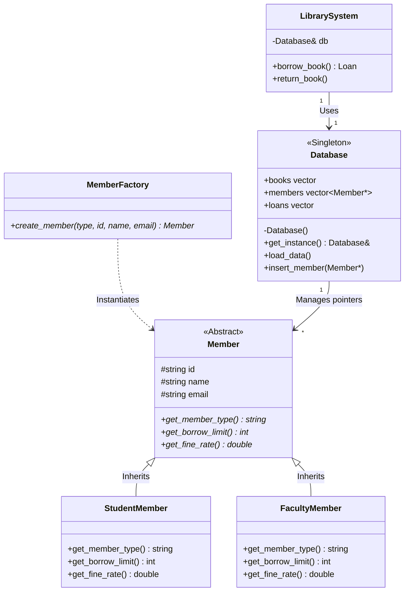

# Library Management System (C++ & SQLite3 Flagship Implementation)

A clean, modular, and SDE-ready C++ implementation of a **Library Management System** demonstrating advanced OOP concepts, design patterns, and automated database persistence.

---

## 1. Project Overview & Problem Statement
This system manages real-world library operations using:
- **Polymorphic member tiers** with different borrowing capacities and fine rates.
- **Transactional SQL persistence** using an embedded SQLite3 engine.
- **Dynamic dependency management** and automated building via CMake.
- **Design patterns** to ensure modularity and scalability.

---

## 2. High-Level Architecture Design



---

## 3. Design Patterns Used

### 1. Singleton Pattern
*   **Where it lives:** [Database.h](file:///C:/Users/saive/library_management_system/Database.h) and [Database.cpp](file:///C:/Users/saive/library_management_system/Database.cpp).
*   **Purpose:** The database connection represents a single physical resource. Implementing `Database` as a Meyers Singleton (via a private constructor and static `get_instance()` accessor) prevents double connections, resource contention, and memory leaks.

### 2. Factory Pattern
*   **Where it lives:** [Models.h](file:///C:/Users/saive/library_management_system/Models.h) (class `MemberFactory`).
*   **Purpose:** Decouples object creation from database retrieval. When querying members from SQL, the database doesn't need to know the concrete class details; it passes the raw database columns to the factory, which returns the appropriate polymorphic subclass pointer (`StudentMember` or `FacultyMember`).

### 3. Strategy Pattern (Polymorphism)
*   **Where it lives:** [Models.h](file:///C:/Users/saive/library_management_system/Models.h) (class `Member` and subclasses).
*   **Purpose:** Allows dynamic calculation of borrow limits and fine rates. Instead of using complex switch-case or if-else statements (which violates the Open/Closed Principle), the business rules are encapsulated inside class structures. Adding a new membership tier (e.g. `GuestMember`) requires writing a new class, with no changes to the checkout validation logic.

---

## 4. Database Schema Design (SQLite3)
The system automatically creates a local database file `library.db` and auto-seeds it if empty.

*   `books` table: `barcode` (PK), `isbn`, `title`, `author`, `is_issued` (INT)
*   `members` table: `id` (PK), `name`, `email`, `type` (TEXT: "Student" or "Faculty")
*   `loans` table: `loan_id` (PK), `member_id` (FK), `barcode` (FK), `issue_date`, `due_date`, `is_returned` (INT)

---

## 5. Project Structure
```text
library_management_system/
├── Models.h           # Member base, Student/Faculty subclasses, and factories
├── Database.h         # Database Singleton declaration
├── Database.cpp       # Schema creation, auto-seeding, and SQL statements
├── LibrarySystem.h    # Checkout validations and business rules declaration
├── LibrarySystem.cpp  # Polymorphic borrow and return check workflows
├── main.cpp           # Interactive terminal UI
├── tests.cpp          # Automated polymorphic SQL unit tests
├── CMakeLists.txt     # CMake file utilizing FetchContent for SQLite3
└── .gitignore         # Excludes build/ and database binaries
```

---

## 6. Compile & Run Instructions

### Prerequisites
- CMake 3.14+
- GCC / G++ supporting C++11 (MinGW on Windows)

### Building the Project
CMake will automatically fetch the official SQLite3 amalgamation package at configure time:
```bash
# 1. Configure the build system (Downloads SQLite3)
cmake -G "MinGW Makefiles" -B build

# 2. Build both simulator and test targets
cmake --build build
```

### Running targets
```bash
# To run the Interactive Simulator
.\build\library_simulator.exe

# To run the Unit Tests
.\build\test_runner.exe
```
